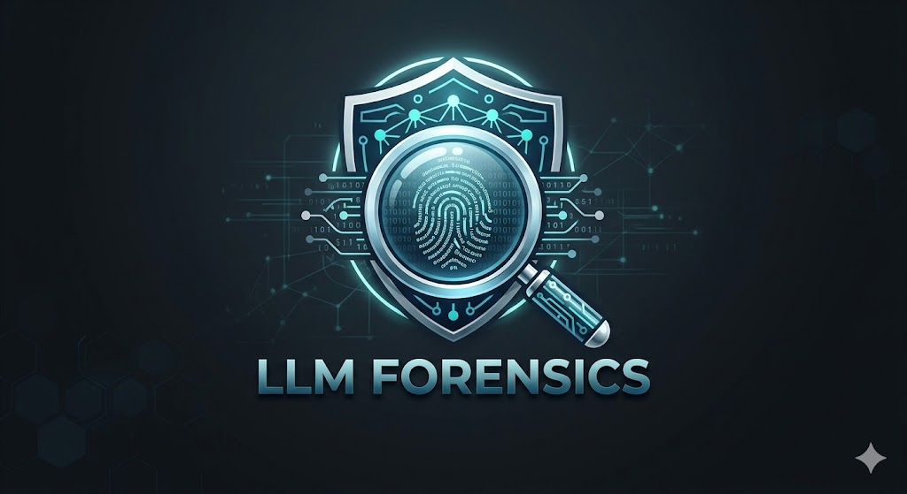

<div align="center">
  
  
  # LLM Forensics Suite
  **Stylometric Intelligence for AI Model Attribution**

  [](https://reactjs.org/)
  [](https://fastapi.tiangolo.com/)
  [](https://vitejs.dev/)
  [](#)

  <p align="center">
    A comprehensive, state-of-the-art forensic toolkit designed to detect, analyze, and attribute AI-generated text to specific Large Language Models (LLMs) using advanced stylometric analysis.
  </p>
</div>

---

## 🌟 Features

- **🛡️ Live Classifier Dashboard:** Analyze text in real-time to identify the underlying LLM (GPT-4, Claude, Gemini, LLaMA, Mistral).
- **🔬 Signal Explainer:** Dive deep into the stylometric features driving the classification—analyzing em-dash rates, hedging phrases, sentence lengths, and formatting tendencies via an interactive radar chart.
- **📊 Accuracy Board:** Monitor classification accuracy, view confusion matrices, and discover algorithmic recommendations to reduce misclassifications.
- **📚 Dataset Builder:** A powerful tool to generate, curate, and search large-scale training datasets for model attribution using targeted LLM generations.
- **✨ Premium UI:** Built with an immersive glassmorphic design, dynamic animations via Framer Motion, and a beautifully tailored dark mode aesthetic.

---

## 🛠️ Tech Stack

### Frontend
- **Framework:** React 19 + Vite
- **Styling:** Vanilla CSS (Glassmorphism, CSS Variables, Modern Grid/Flexbox)
- **Animations:** Framer Motion
- **Icons:** Lucide React
- **HTTP Client:** Axios

### Backend
- **Framework:** FastAPI
- **AI Integration:** Google Gemini API (for advanced feature extraction & generation)
- **Data Science:** NumPy, Scikit-learn, LightGBM (Stylometric analytics)
- **Server:** Uvicorn

---

## 🚀 Getting Started

### Prerequisites
- Node.js (v18 or higher)
- Python (3.9 or higher)
- Google Gemini API Key

### 1. Clone the repository
```bash
git clone https://github.com/omm-prakash18/llm-forensics-suite.git
cd llm-forensics-suite
```

### 2. Backend Setup
Set up your Python virtual environment and install dependencies:
```bash
python -m venv venv
# Windows: venv\Scripts\activate | Mac/Linux: source venv/bin/activate
pip install -r requirements.txt
pip install python-dotenv requests
```

Create a `.env` file in the root directory and add your API key:
```env
GEMINI_API_KEY=your_gemini_api_key_here
```

Start the FastAPI server:
```bash
uvicorn src.app:app --host 127.0.0.1 --port 8000 --reload
```

### 3. Frontend Setup
Open a new terminal, navigate to the frontend directory, and start the development server:
```bash
cd frontend
npm install
npm run dev
```

Visit `http://localhost:5173` in your browser to access the LLM Forensics Suite.

---

## 📁 Project Structure

```text
llm-forensics-suite/
├── .env                    # Environment variables (API Keys)
├── data/
│   └── datasets.json       # Backend database for the Dataset Builder
├── src/
│   ├── app.py              # FastAPI main server & endpoints
│   └── feature_extraction.py # NLP Stylometric extraction logic
├── frontend/
│   ├── public/             # Static assets (Logo, etc)
│   ├── src/                
│   │   ├── App.jsx                 # Main layout & navigation
│   │   ├── ClassifierDashboard.jsx # Live classification UI
│   │   ├── DatasetBuilder.jsx      # Dataset generation UI
│   │   ├── SignalExplainer.jsx     # Stylometric probing UI
│   │   ├── AccuracyBoard.jsx       # Analytics & confusion matrix UI
│   │   ├── index.css               # Global glassmorphism design system
│   │   └── main.jsx
│   └── package.json
└── requirements.txt        # Python dependencies
```

---

## 🤝 Contributing
Contributions, issues, and feature requests are welcome!

## 📄 License
This project is licensed under the MIT License.
